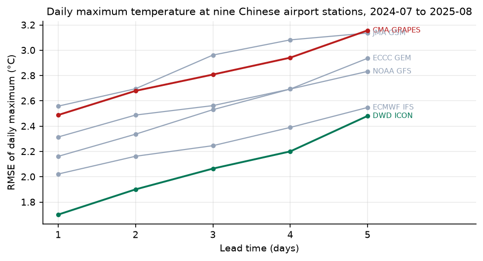

# Verifying global weather models at Chinese stations

Eight operational global models, nine Chinese airport stations, fourteen months,
verified against station observations at a **fixed forecast lead** — which is the
part most comparisons skip.

The subject is daily maximum 2 m temperature, the variable that drives cooling
load, and the question is not which model wins a global average. It is which one
is closest **here**, how much of its error is a constant anyone could remove,
and whether the answer is different in China than anywhere else.



## What it found

**DWD ICON beats ECMWF IFS, and the margin holds up.** At one day ahead, ICON's
RMSE is 1.70 °C against ECMWF's 2.02 °C. Because both models forecast the same
days, the comparison is paired: ICON's mean absolute error is 0.29 °C smaller,
with a bootstrap interval of −0.33 to −0.26 that comfortably excludes zero.
ECMWF is second, and the gap to third is larger than the gap to first.

| Model | RMSE | Bias | MAE | RMSE after debiasing | Misses ≥ 3 °C |
|---|---|---|---|---|---|
| DWD ICON | **1.70** | −0.80 | 1.36 | 1.50 | 7.3% |
| ECMWF IFS | 2.02 | −1.11 | 1.65 | 1.69 | 13.9% |
| ECCC GEM | 2.16 | −0.97 | 1.70 | 1.93 | 16.9% |
| NOAA GFS | 2.32 | −0.69 | 1.83 | 2.21 | 19.7% |
| CMA GRAPES | 2.49 | −1.45 | 2.02 | 2.02 | 23.7% |
| JMA GSM | 2.56 | −1.58 | 2.04 | 2.01 | 23.6% |

Day-1 lead, nine Chinese stations, 3,733 forecast–observation pairs on the days
all six models ran. Degrees Celsius.

**Every model runs cold on the daily maximum, and it is not a China effect.**
Biases run from −0.69 to −1.58 °C. The obvious hypothesis is something Chinese —
urban heat, siting, the monsoon — and it is wrong: the four control stations in
London, Frankfurt, New York and Tokyo show a mean bias of −0.99 °C against
China's −1.10 °C. Whatever causes it, these models under-predict the afternoon
peak at airports generally. That is worth knowing before anyone builds a
correction that assumes a local cause.

**A small bias is not the same as a good model.** Squared bias accounts for 38%
of JMA's mean squared error, 34% of CMA GRAPES's and 30% of ECMWF's, but only 9%
of GFS's. Remove each model's constant offset and the middle of the table
reshuffles: GFS drops from fourth to sixth, JMA climbs from sixth to fourth.
GFS looked respectable because its bias was small, not because its day-to-day
errors were.


**CMA GRAPES is fifth of six, and a third of that is a fixable offset.** It
carries the second-largest cold bias in the set. On the wider eight-model
comparison at leads 1 to 3 it moves up two places once debiased. Anyone using it
operationally in China should fit a per-station offset before anything else; on
this sample that single number removes about a third of its mean squared error.


Station biases are not uniform. GFS is 3.0 °C cold at Hong Kong and 1.4 °C
**warm** at Shenzhen, two stations 30 km apart, which is a coastal
representativeness problem rather than a model-physics one.

## Why fixed lead is the whole study

An earlier version of this dataset was assembled from Open-Meteo's historical
forecast archive, which returns the best forecast available for each hour. That
is the right choice for trading and the wrong one for verification: the "best
available" forecast is whatever the most recent run said, at whatever lead that
happened to be, and averaging over it produces a score that describes no product
anyone can buy.

This version uses the previous-runs archive, where
`temperature_2m_previous_day3` means exactly "what this model said three days
before", per model. Every number here is at a stated lead.

Three more choices that decide whether a scorecard means anything:

- **Common sample.** Models drop out of the archive. Météo-France ARPEGE is only
  held to day 3; UKMO covers 60% of days. A mean over whatever days a model
  happened to run rewards it for the days it skipped, so every comparison is
  restricted to days on which every model in that comparison produced a forecast.
  Hence two sets: six models at leads 1–5, all eight at leads 1–3.
- **Paired tests.** Two models verified on the same 400 days saw the same
  weather and are not independent samples. Differences are tested as per-day
  differences in absolute error with a bootstrap over days, and a model is only
  called better when the interval excludes zero.
- **Bias reported separately from error.** A model that is two degrees cold every
  day and one that is two degrees out at random both have an RMSE of two. Only
  one of them is fixable with a constant.

## What it does not show

- **Airports, not cities.** METAR is the only free, genuinely observed hourly
  temperature record, and it comes from airports, which sit on flat open ground
  outside town on purpose. A model verified at ZBAA has not been verified over
  Beijing's third ring road.
- **Nine stations.** Enough to rank models, not enough to map regional skill.
- **One variable.** Daily maximum 2 m temperature. Nothing here says anything
  about wind, radiation, or precipitation, and a model that wins on temperature
  need not win on the variables that drive renewable output.
- **Hourly sampling.** Both the forecast and the observation are reduced to the
  maximum of 24 hourly values, so both miss the instantaneous peak. The
  comparison is fair; the absolute maxima are slightly low.
- **No AI models yet.** ECMWF AIFS, Pangu, GraphCast and FuXi are the point of
  the exercise and are not in this table. Adding them is the next step, and the
  machinery — fixed lead, common sample, paired tests — is built for it.

## Running it

```bash
conda create -n aiwp python=3.12 -y && conda activate aiwp
pip install pandas pyarrow numpy scipy matplotlib pytest

python -m aiwp.build_dataset      # fetch and cache; ~3 min, then offline
python -m aiwp.run_verification   # scorecards, paired tests, results.json
python -m aiwp.make_figures
python -m pytest tests -q         # 15 tests
```

## Data

| What | Source | Licence |
|---|---|---|
| Forecasts at fixed lead, 8 models, days 1–5 | [Open-Meteo previous-runs archive](https://open-meteo.com/en/docs/previous-runs-api) | CC BY 4.0, free for non-commercial use |
| Station observations, hourly METAR | [Iowa State Mesonet ASOS archive](https://mesonet.agron.iastate.edu/request/download.phtml) | public, no account |

198,333 forecast–observation pairs, 13 stations, 427 days, 2024-07-01 to
2025-08-31. No raw data is redistributed; `build_dataset` fetches it.

Models: ECMWF IFS 0.25°, NOAA GFS, DWD ICON, JMA GSM, ECCC GEM, Météo-France
ARPEGE, UKMO, and **CMA GRAPES** — the Chinese operational global model, which
does not appear in the published international comparisons.

## Layout

```
src/aiwp/
  stations.py          the nine Chinese stations and four controls, with ICAO codes
  fetch.py             fixed-lead forecasts, METAR observations, daily reduction
  verify.py            scores, common sample, paired bootstrap
  build_dataset.py     fetch everything, print the coverage audit
  run_verification.py  scorecards and significance tests
  make_figures.py      three figures
tests/                 15 tests, expectations hand-computed
reports/               scorecards, results.json, figures
```
