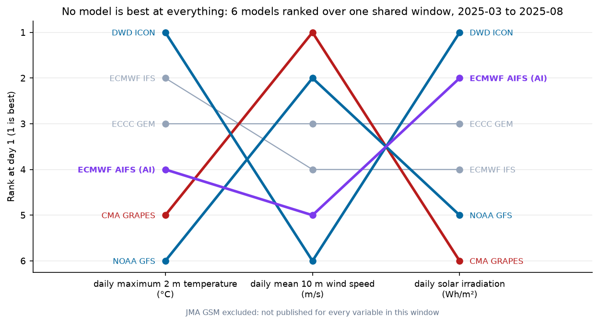
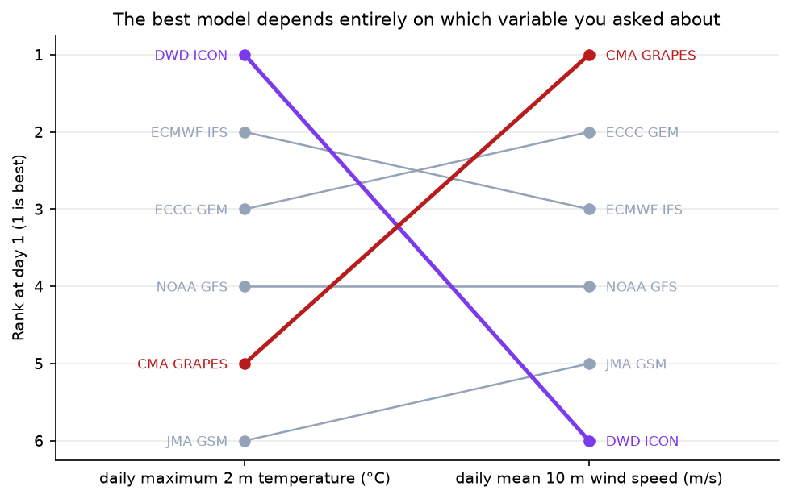
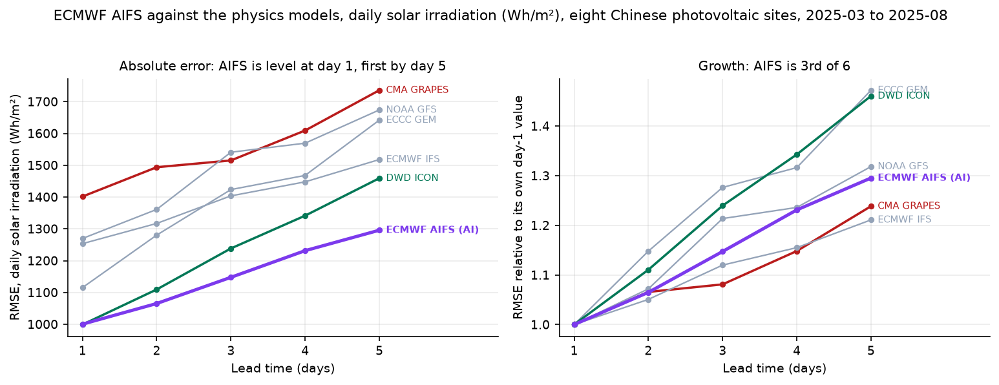
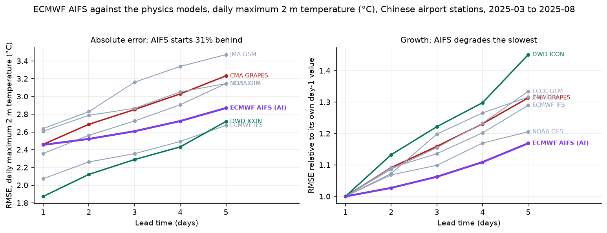
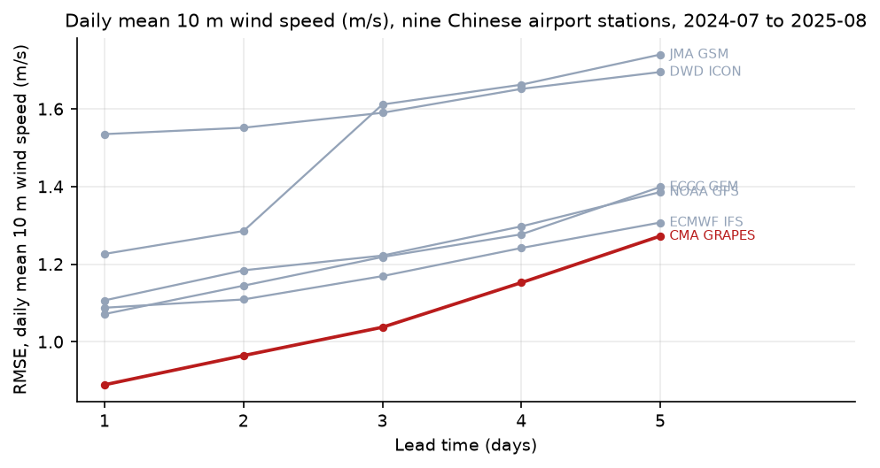
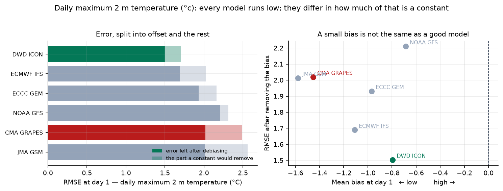
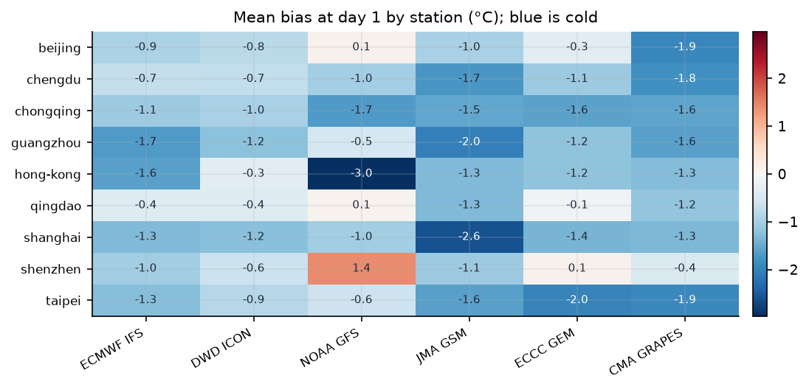

# Verifying global weather models at Chinese stations

Ten operational global models — eight physics-based and two machine-learned —
nine Chinese airport stations and eight Chinese photovoltaic sites, fourteen
months, three variables, verified at a **fixed forecast lead**, which is the
part most comparisons skip. Temperature and wind are scored against station
observations; solar irradiation, where no station instrument exists, against a
satellite retrieval.

A second set scores the same models where the plants are — twelve airports in the
wind provinces and ten points inside PV-base counties — and is regenerated as a
[monthly leaderboard](#where-the-plants-are-a-leaderboard-for-the-energy-provinces).

The question is not which model wins a global average. It is which one is
closest **here**, on the variable you actually care about, and how much of its
error is a constant anyone could remove.

## First, is any of it better than doing nothing?

A scorecard full of decimals is not worth reading until the baseline is on it.
The baseline is persistence: copy the observation from `lead` days ago — at one
day ahead, yesterday's value; at five days ahead, the value from five days back.
Matching the lead is the whole point, because a baseline that always used
yesterday would beat every model at day 5 and mean nothing.

On the energy-province sets, one day ahead:

| | Persistence | Best model | Skill | Observed mean |
|---|---|---|---|---|
| 10 m wind, 12 airports | 1.28 m/s | NOAA GFS **0.89** | **0.52** | 3.06 m/s |
| Daily irradiation, 10 PV points | 2,376 Wh/m² | ECMWF IFS **978** | **0.83** | 6,571 Wh/m² |

Skill is `1 − MSE/MSE_persistence`: 0 is no better than doing nothing, 1 is
perfect. Forecasting halves the squared error on wind and removes five sixths of
it on irradiation — and **NOAA GFS five days out (1.12 m/s) is still closer than
yesterday's wind (1.28)**.

The more useful half of that table is how the two sides age. From day 1 to day 5
the models lose 15 to 75 per cent, persistence only 19 to 21: it is already near
the day-to-day variability of the place and has nowhere further to fall. That is
why the skill number should be read at day 1 and distrusted at day 5, where an
easy baseline flatters everyone.

Persistence can only copy observations that are in the dataset, so the first
days of each record, and any day the hourly-coverage rule discarded, have no
baseline; the station-day counts are printed beside every number in the
[leaderboard](reports/leaderboard/).

**The same baseline says the opposite thing at a shorter horizon**, which is
worth stating here because it is the reason a weather model is bought at all. In
a companion study of plant-level power forecasting (pv-wind-power-forecast, not
public), a learned model inside four hours gains only 0.02 to 0.13 skill over
plain persistence on wind, and clear-sky persistence is 1 to 20 per cent behind
it on photovoltaics — beating it outright at one of seven stations. Nowcasting
is where doing nothing is nearly as good as doing something. Day-ahead is where
it stops being: the gap this page measures, half the squared error on wind and
five sixths on irradiation, is what a numerical weather prediction buys you and
an extrapolation of the last observation cannot.

## The finding

**There is no best model. There is a best model per variable, and the ranking
inverts between them.**



Six models, three variables, one shared six-month window. DWD ICON is first on
temperature, **last on wind**, and first again on irradiation. CMA GRAPES is
fifth on temperature, **first on wind**, and last on irradiation. NOAA GFS runs
the same pattern in reverse. Only ECCC GEM holds the same place on all three,
and that place is third.

| Model | Temperature | 10 m wind | Solar irradiation |
|---|---|---|---|
| DWD ICON | **1** | 6 | **1** |
| ECMWF AIFS (AI) | 4 | 5 | 2 |
| ECCC GEM | 3 | 3 | 3 |
| ECMWF IFS | 2 | 4 | 4 |
| NOAA GFS | 6 | **2** | 5 |
| CMA GRAPES | 5 | **1** | 6 |

Over the full fourteen-month archive, where only temperature and wind exist, the
same reversal appears at the four control stations in London, Frankfurt, New York
and Tokyo, so it is a property of the models rather than of China.



Anyone choosing a weather data provider on one headline accuracy figure is
choosing wrong for every other use they have. For a wind-power operator in
China, the model that the international comparisons rank near the bottom is the
one that was closest to the anemometer. For a solar operator, the model that won
the wind comparison is the worst of the six.

## Where the machine-learned models land

ECMWF AIFS is the operational machine-learned forecast, and placing it against
the physics models at Chinese stations is the question this repository was built
for. It enters the archive on 2025-02-21, so it is scored on its own window —
March to August 2025, 183 days — with the physics models restricted to exactly
the same days.

**At one day ahead AIFS does not win the station variables.** Fourth of seven
on daily maximum temperature, sixth of seven on 10 m wind, and its deficit
against ECMWF IFS is significant on both: +0.22 °C and +0.11 m/s of mean
absolute error, bootstrap intervals excluding zero.

**On solar irradiation it is already level, and it beats ECMWF's own physics
model.** Second of six at day 1, 1,000 Wh/m² against DWD ICON's 999 — a paired
difference of +11 Wh/m² with an interval of −26 to +47 that spans zero, which is
a tie and not a loss. Against ECMWF IFS, the model from the same institution, it
is **228 Wh/m² better** in mean absolute error, interval −260 to −196. By day 5
it is first outright, and by a margin no physics model comes near.



| Model | Day 1 | Day 5 | Growth |
|---|---|---|---|
| **ECMWF AIFS (AI)** | 1,000 | **1,296** | +29.5% |
| DWD ICON | **999** | 1,459 | +46.1% |
| ECMWF IFS | 1,254 | 1,518 | +21.1% |
| ECCC GEM | 1,115 | 1,642 | +47.2% |
| NOAA GFS | 1,270 | 1,674 | +31.8% |
| CMA GRAPES | 1,402 | 1,736 | +23.9% |

RMSE of daily solar irradiation, Wh/m², eight photovoltaic sites, six-model
common sample. Mean observed irradiation is 5,457 Wh/m², so day-1 RMSE runs from
18.3% of the daily total for ICON and AIFS to 25.7% for CMA GRAPES.

This is the variable a photovoltaic forecast is built on, and it is the one where
the machine-learned model is already competitive at the lead a dispatch centre
submits on. Note also where ECMWF IFS lands: fourth of six, 23.0% against ICON's
18.3%. The model with the best global reputation is not the one to drive a solar
forecast with here.

**Across all three variables its error grows the slowest or close to it.**



| Model | Day 1 | Day 5 | Growth |
|---|---|---|---|
| **ECMWF AIFS (AI)** | 2.46 | 2.87 | **+16.9%** |
| NOAA GFS | 2.61 | 3.15 | +20.6% |
| ECMWF IFS | 2.07 | 2.68 | +29.0% |
| CMA GRAPES | 2.46 | 3.23 | +31.4% |
| JMA GSM | 2.64 | 3.47 | +31.6% |
| ECCC GEM | 2.36 | 3.15 | +33.4% |
| DWD ICON | **1.87** | 2.72 | +45.1% |

RMSE of daily maximum temperature, °C, Chinese stations, seven-model common
sample.

The gap between AIFS and ECMWF IFS narrows from 0.39 °C at day 1 to 0.19 °C at
day 5; against ICON, which wins day 1 outright, it narrows from 0.59 to 0.15.
The same shape appears on wind and at the four control stations, so it belongs
to the model and not to the region.

That is the known signature of a machine-learned forecast — smoother fields,
less sharpness at short range, and a shallower decay because there is no
imperfect dynamical integration accumulating error. Two consequences worth
stating plainly:

- **For day-ahead station variables these models are not the answer here yet.**
  At the lead a dispatch centre actually submits on, every well-ranked physics
  model was closer on temperature and on 10 m wind.
- **For day-ahead irradiation the answer has already changed.** AIFS is level
  with the best physics model and ahead of four of the other five, on the
  variable that drives photovoltaic output.
- **For the medium range the choice is not arguable, it is made.** AIFS is first
  on irradiation by day 5 and closing on the others elsewhere. A verification
  quoted at a single lead and a single variable — which is most of them — hides
  all of this.

GraphCast is in the archive but covers 37 to 59 per cent of days depending on
the variable, so it is reported separately rather than dropped or averaged over
the days it happened to run.

## The scorecards

**Daily maximum 2 m temperature**, day-1 lead, nine Chinese stations, 3,733
pairs on the days all six models ran:

| Model | RMSE | Bias | MAE | After a rolling offset | Misses ≥ 3 °C |
|---|---|---|---|---|---|
| DWD ICON | **1.70** | −0.80 | 1.36 | **1.43** | 7.3% |
| ECMWF IFS | 2.02 | −1.11 | 1.65 | 1.54 | 13.9% |
| ECCC GEM | 2.16 | −0.97 | 1.70 | 1.74 | 16.9% |
| NOAA GFS | 2.32 | −0.69 | 1.83 | 1.73 | 19.7% |
| CMA GRAPES | 2.49 | −1.45 | 2.02 | 1.82 | 23.7% |
| JMA GSM | 2.56 | −1.58 | 2.04 | 1.83 | 23.6% |

**Daily mean 10 m wind speed**, same stations, same days, metres per second:

| Model | RMSE | Bias | MAE | After a rolling offset |
|---|---|---|---|---|
| CMA GRAPES | **0.89** | −0.16 | 0.65 | 0.82 |
| ECCC GEM | 1.07 | −0.36 | 0.83 | 0.80 |
| ECMWF IFS | 1.09 | −0.76 | 0.88 | **0.70** |
| NOAA GFS | 1.11 | −0.32 | 0.83 | 0.81 |
| JMA GSM | 1.23 | −0.67 | 1.00 | 0.80 |
| DWD ICON | 1.54 | −1.27 | 1.29 | 0.73 |

The last column is what is left after a thirty-day offset fitted per station on
earlier days only, on the 3,598 pairs where every model had one; the other
columns use all 3,733. Note how much it changes. ECMWF and ICON have the
*smallest* wind error once their offsets are removed and the *largest* offsets —
their wind problem is calibration. CMA GRAPES, first on raw error, is last but
one corrected, because it barely had an offset to remove. The whole table
collapses from a 0.89-to-1.54 spread into 0.70-to-0.82: at day 1, ranking these
models on raw wind error is close to ranking their calibration.



**Daily solar irradiation**, eight photovoltaic sites, day-1 lead, 7,740 pairs
over the 173 days all six models ran, Wh/m² against a satellite retrieval:

| Model | RMSE | % of daily total | Bias | MAE | After a rolling offset |
|---|---|---|---|---|---|
| DWD ICON | **999** | 18.3% | −231 | **788** | 972 |
| ECMWF AIFS (AI) | 1,000 | 18.3% | −174 | 799 | **941** |
| ECCC GEM | 1,115 | 20.4% | +92 | 834 | 1,119 |
| ECMWF IFS | 1,254 | 23.0% | −204 | 1,027 | 1,063 |
| NOAA GFS | 1,270 | 23.3% | +115 | 940 | 1,274 |
| CMA GRAPES | 1,402 | 25.7% | +51 | 1,120 | 1,280 |

Unlike temperature, irradiation bias is small relative to the error and signed
both ways, and the offset buys much less: 5% for ICON against 29% of ICON's mean
squared temperature error, and for GEM and GFS, whose bias is a rounding error
against a 1,100 Wh/m² RMSE, it buys nothing at all — estimating an offset that is
not there only adds the noise of estimating it. What is left is day-to-day cloud,
which is the hard part and the reason a solar forecast is harder than a
temperature forecast. The last column is on the 1,170 pairs where every model had
an offset; the others use all 1,290.

## What else it found

**Every model runs cold on the daily maximum, and it is not a China effect.**
Biases run from −0.69 to −1.58 °C. The obvious hypothesis is something Chinese —
urban heat, siting, the monsoon — and it is wrong: the four control stations in
London, Frankfurt, New York and Tokyo show a mean bias of −0.99 °C against
China's −1.10 °C. Whatever causes it, these models under-predict the afternoon
peak at airports generally. That is worth knowing before anyone builds a
correction that assumes a local cause.

**Every model also runs slow on wind**, by 0.16 to 1.27 m/s. Under-forecasting
wind speed matters more than the number suggests: turbine power goes as roughly
the cube of wind speed near the middle of the power curve, so ICON's 1.27 m/s
deficit on a 3.5 m/s mean is not a 36% error in the input, it is most of the
output.

**A small bias is not the same as a good model, and a small bias is not the same
as nothing to correct.** Fit each model a rolling thirty-day offset per station,
on days that had already happened, and it removes 49% of JMA's mean squared
error, 48% of CMA GRAPES's, 44% of GFS's, 40% of ECMWF's, 34% of GEM's and 29% of
ICON's. The middle of the table reshuffles: GFS climbs from fourth to third, GEM
drops from third to fourth.

GFS is the instructive one. Its mean bias, −0.69 °C, is the smallest in the set,
and taking that single constant out of the whole sample would have bought it
almost nothing — 2.32 down to 2.21. A per-station offset takes it to 1.73. Its
biases are large and differ by station, and they cancel in the national average.
One number for the country hides that; one number per station finds it.



**CMA GRAPES is fifth of six, and half of that is a fixable offset.** It carries
the second-largest cold bias in the set, and the rolling offset removes 48% of its
mean squared error — the largest share of any model here bar JMA. It does not
change its place: every model improves, so the correction that rescues GRAPES's
numbers rescues everyone else's too, and on the wider eight-model set it stays
seventh of eight before and after. Anyone using it operationally in China should
still fit a per-station offset before anything else. That is worth doing for its
own sake, not because it would buy a better model.



Station biases are not uniform. GFS is 3.0 °C cold at Hong Kong and 1.4 °C
**warm** at Shenzhen, two stations 30 km apart, which is a coastal
representativeness problem rather than a model-physics one.

## Pangu and Aurora: the models no point API serves

This repository carries two machine-learned models because those are the two a
point API serves. Pangu-Weather, Aurora and FourCastNet are not on any point
API, and that used to be the end of it.

NOAA archives all of them — twice a day since 2020, as global fields, with a
kerchunk index that makes the archive readable as one array. A chunk is one run
at one lead over the whole globe, so a station costs the same as a country and
nine stations cost the same as one. Three months of one model at one lead takes
about four minutes.

**The check came before the result, and it found something.** NOAA's GraphCast
and the point API's GraphCast are the same model from the same initial
conditions, so they have to agree. They correlate at 0.911 and differ by 0.446
m/s — twenty per cent of the mean wind. Split by station, the answer is clean:
the spread of per-station offsets is 0.519 and the residual after removing them
is 0.333, and every large offset is coastal — Hong Kong +1.37, Shanghai Pudong
+0.70, Shenzhen +0.50 — while the inland stations sit at ±0.13.

**A 0.25° nearest grid point at a coastal airport lands on water**, and sea is
smooth, so 10 m wind there is systematically stronger. The point API interpolates
and handles the land-sea boundary. That offset moves the three archive models and
not the point API's models, which is exactly the comparison being made — so the
scorecard runs on the stations where the two sources agree, and says so.

On those four inland stations, one day ahead, over January to March 2025
(88 station-days):

| | RMSE | Distinguishable from first? |
|---|---|---|
| NOAA GFS | **0.86** | — |
| CMA GRAPES | 0.89 | no, a tie |
| ECMWF IFS | 0.93 | no, a tie |
| **Aurora (AI)** | 1.01 | yes |
| **Pangu-Weather (AI)** | 1.05 | no, a tie |
| **GraphCast (AI)** | 1.11 | yes |

**The machine-learned models do not win here.** At three days CMA GRAPES leads,
NOAA GFS ties it, and all three learned models are significantly behind. That
agrees with the main study, where CMA GRAPES is first on wind.

One thing does turn over between the two leads: GraphCast is the worst of the
three learned models at one day (1.11) and the best of them at three (1.15),
because it barely degrades while Aurora goes 1.01 → 1.23 and Pangu 1.05 → 1.24.
Read that as a hint rather than a result — the two leads are scored on their own
common samples, 88 and 120 station-days, and a difference that size is not
something a hundred station-days settles.

One season, four stations, about a hundred station-days each: that is why every
row carries whether it can be told apart from the first at all, and why most
cannot. The full page, both leads and the station-level diagnosis, is
[reports/mlwp.md](reports/mlwp.md).

## Hub height, and what it costs to verify without an instrument

10 m is not where a rotor turns, and the leaderboard says so in its own caveats.
Closing that gap runs into two hard facts: only four of the ten models publish
100 m wind through this archive — ECMWF IFS, NOAA GFS, DWD ICON and ECMWF AIFS —
and nothing at these airports measures wind at that height, so the only available
truth is ERA5.

ERA5 is a reanalysis produced by ECMWF, and two of the four models being judged
are ECMWF's own. That is normally written as a caveat and forgotten. It does not
have to be: the same four models also forecast 10 m wind, where an anemometer
exists, so the same ranking can be computed twice on the same 6,576 station-days,
once against each truth.

| Model | vs anemometer | vs ERA5 | Change | Rank, anemometer | Rank, ERA5 |
|---|---|---|---|---|---|
| NOAA GFS | 0.90 | 0.91 | +0.00 | **1** | 3 |
| ECMWF IFS | 1.07 | 0.77 | −0.30 | 2 | 2 |
| DWD ICON | 1.07 | 1.03 | −0.04 | 3 | 4 |
| ECMWF AIFS (AI) | 1.20 | 0.55 | **−0.65** | 4 | **1** |

Changing the yardstick, and nothing else, is worth **0.47 m/s to the two ECMWF
models and 0.02 m/s to the other two** — and it inverts the ranking. The biggest
winner is AIFS, which is a machine-learned model **trained on ERA5**: scoring it
against ERA5 is close to scoring it against its own training target.

That number then reads the 100 m table for you. Across those four models the
whole table spans 0.33 m/s, which is *less* than the 0.45 m/s the yardstick is
worth. So the 100 m ranking cannot be read as a ranking — the bias of the
measuring stick alone is enough to produce it. The full page is
[reports/hub_height.md](reports/hub_height.md).

This is also the reason irradiation here is verified against a satellite
retrieval rather than a reanalysis, and the reason that choice is worth the
trouble.

## Where the plants are: a leaderboard for the energy provinces

The nine airports above were chosen to cover the country. A plant operator needs
the ranking where the plants are, so the same models are scored on two further
sets and written as one dated page, [`reports/leaderboard/`](reports/leaderboard/),
that can be regenerated each month: twelve airports across the north, north-east
and north-west for 10 m wind against METAR, and ten points inside PV-base
counties — Gonghe, Golmud, Zhongwei, Dunhuang, Hami, Dalad, Zhangbei, Datong,
Dongying, Yancheng — for daily irradiation against satellite retrieval.

> **Corrected on 2026-09-21.** Two numbers in this section were computed in ways
> that flattered them, and both have been recomputed. The column headed "with the
> constant offset removed" took each model's mean error out of the very sample it
> was then scored on, which no correction can achieve because it needs the bias
> before the day arrives; it is now fitted on the previous thirty days only, and
> the ranking it produces is different. And each per-station and per-month winner
> was judged on its own interval, so the page made a dozen or more judgements and
> called each of them 95%; they are now also reported after a Holm correction over
> the table a reader sees at once, and most of them do not survive it. The
> sentence "nobody running plants in several provinces can buy one model" rested
> on the uncorrected count and has been rewritten. Earlier wording is in the commit
> history.

**Wind, March 2025 to August 2026, 4,584 station-days.** NOAA GFS is first at
day 1 (0.90 m/s) and its lead over UKMO is significant; CMA GRAPES, first at the
nine national airports, is third here, and ECMWF AIFS is last. Change the stations
and the ranking changes, which is the finding of this repository once more.

Almost all of that ranking is constant bias. Fit each model a rolling thirty-day
offset per station — using only days that had already happened, which is what an
operator would have to do — and the order inverts: ECMWF IFS first at 0.67 m/s,
UKMO 0.68, ECMWF AIFS 0.69, DWD ICON 0.71, and GFS, first on raw error, last of
those five at 0.74. AIFS is worst of all raw and third once corrected, because a
0.50 m/s under-forecast is most of what was wrong with it. A raw leaderboard
mostly ranks calibration, and calibration is the cheap part.

The claims this page can carry about a single station or a single month are
weaker than its tables first suggest. GFS takes first place in 13 of 18 months,
but only two of those leads are distinguishable from the runner-up on their own,
and none survives a correction across the eighteen. Twelve stations produce six
different winners; three of the twelve leads stand on their own and two after
correction — Taiyuan and Ürümqi. So this set does not show that a fleet spread
over several provinces needs a different model at each site. At ten of the twelve
stations the present sample cannot tell the best model from the second best at
all, and the argument for choosing per region rests on the aggregate reversal
instead: CMA GRAPES leads at the nine national airports and is third here, while
GFS leads here.

**Irradiation, late May to August 2026, 857 station-days.** ECMWF AIFS (957
Wh/m²) and ECMWF IFS (967) are level at day 1, with Météo-France ARPEGE third and
CMA GRAPES last. The rolling offset separates them: AIFS carries a −446 Wh/m²
bias and falls to 858 once it is removed, while IFS, which carries almost none
(−34), rises to 983 — correcting a model that has nothing to correct only adds
the noise of estimating the offset. AIFS also grows slowest with lead, +50% from
day 1 to day 5 against +73 to +75% for IFS and ICON, which is what the 2025 window
showed at the anonymised sites. Four of the ten points go to AIFS and four to
ARPEGE, one each to IFS and ICON; one of those ten leads stands on its own and
none survives the correction across the ten.

Building this set found three things wrong with the inputs rather than the models.

- **"Still updating" does not mean hourly.** The wind bases themselves — Hami,
  Jiuquan, Xilingol, Zhangbei — have airports and no usable METAR record. Of the
  46 Chinese stations the archive lists as current, Jinan returned 350 reports in
  eighteen months and Ordos and Nantong none with a wind speed. Each candidate was
  checked for a full month of hourly wind before it was used.
- **The satellite archive has moved.** In mid-September 2025-dated irradiance
  could be fetched for these longitudes; now the same product starts in May 2026.
  The irradiation window is therefore about a hundred days, and the 2025 pairs
  committed here can no longer be rebuilt from source.
- **The forecast archive serves a different quantity at some leads.** GEM's
  irradiance beyond day 3 runs 30% above its own day-1 forecasts for the same
  dates, and from 2026-08-11 reaches 2,900 W/m² at noon, twice the solar
  constant; ARPEGE runs 8 to 13% high at days 2 and 3. Every other model agrees
  with itself across leads to within 1%. Scored as delivered, GEM's day-5 error
  was 6,590 Wh/m² and looked like a result. Two guards now stand in the way:
  hourly irradiance above 1,400 W/m² is discarded, and a model-lead whose mean
  departs from the same model's day-1 mean by more than 10% is dropped for the
  window and named on the page. The pairs published for 2025 pass both.

The unit guard on irradiance had also been comparing the API's hourly W/m² with
the daily total's Wh/m² and would have refused every request; a warm cache had
kept that from showing. It now compares against what the API returns.

## Why fixed lead is the whole study

An earlier version of this dataset was assembled from Open-Meteo's historical
forecast archive, which returns the best forecast available for each hour. That
is the right choice for trading and the wrong one for verification: the "best
available" forecast is whatever the most recent run said, at whatever lead that
happened to be, and averaging over it produces a score that describes no product
anyone can buy.

This version uses the previous-runs archive, where
`temperature_2m_previous_day3` means exactly "what this model said three days
before", per model. Every number here is at a stated lead.

Three more choices that decide whether a scorecard means anything:

- **Common sample.** Models drop out of the archive. Météo-France ARPEGE is only
  held to day 3; UKMO covers 60% of days. A mean over whatever days a model
  happened to run rewards it for the days it skipped, so every comparison is
  restricted to days on which every model in that comparison produced a forecast.
  Hence two sets: six models at leads 1–5, all eight at leads 1–3.
- **Paired tests.** Two models verified on the same 400 days saw the same
  weather and are not independent samples. Differences are tested as per-day
  differences in absolute error with a bootstrap over days, and a model is only
  called better when the interval excludes zero.
- **Bias reported separately from error.** A model that is two degrees cold every
  day and one that is two degrees out at random both have an RMSE of two. Only
  one of them is fixable with a constant.

## What it does not show

- **Airports, not cities.** METAR is the only free, genuinely observed hourly
  temperature record, and it comes from airports, which sit on flat open ground
  outside town on purpose. A model verified at ZBAA has not been verified over
  Beijing's third ring road.
- **Nine stations.** Enough to rank models, not enough to map regional skill.
- **10 m is not hub height, and it cannot be fixed here.** A turbine hub sits at
  80 to 120 m, where the wind is stronger, smoother and differently biased.
  Extrapolating these 10 m results up a shear profile is a further assumption,
  not a result. Verifying 100 m wind directly would need a hub-height
  observation, and no free one exists at these sites — a reanalysis is not an
  observation, and scoring forecasts against one would mostly measure how close
  each model is to ECMWF's analysis. **100 m wind is therefore reported as
  unverified rather than verified against a substitute.** Nothing here says
  anything about precipitation.
- **The irradiance truth is a satellite retrieval, not a pyranometer.** It is
  what the solar industry assesses resource with, and it is the only hourly
  irradiance record available at these sites, but it carries its own error —
  several per cent on daily totals, more under broken cloud. Part of every
  irradiance score in this study is retrieval error rather than forecast error.
  The comparison between models is unaffected, because all six are scored
  against the same retrieval; the absolute numbers are upper bounds.
- **The photovoltaic coordinates were recovered, not given.** The eight sites
  come from an anonymised operator dataset with no locations, and their
  positions were fitted from the generation series itself. One of the eight
  lands just outside the national border in eastern Myanmar, which it cannot
  actually be, so its satellite pixel is the wrong pixel by some tens of
  kilometres. It is kept and named rather than quietly dropped. A second site,
  at 78.7°E, sits between the Himawari and Meteosat-IODC disks and has satellite
  coverage on only 79 of the 173 days.
- **Hourly sampling.** Both the forecast and the observation are reduced to the
  maximum of 24 hourly values, so both miss the instantaneous peak. The
  comparison is fair; the absolute maxima are slightly low.
- **One AI model properly, one partially.** AIFS is scored over its full window;
  GraphCast is patchy. Pangu and FuXi are in no archive this study can reach at
  a fixed lead without downloading global fields, which is the next step and a
  much heavier one.
- **Deterministic runs only.** AIFS also publishes an ensemble, and setting one
  deterministic member against physics-model ensembles would be a different and
  more flattering question than the one asked here.

## Running it

```bash
conda create -n aiwp python=3.11 -y && conda activate aiwp
pip install pandas pyarrow numpy scipy matplotlib pytest
pip install -e .

make verify figures   # every table and figure, from the pairs committed in data/
make test             # 40 tests
make leaderboard      # the energy-province page, from the pairs committed in data/
make data             # optional: rebuild the pairs from the archives (slow, quota-bound)
make energy           # optional: extend the energy-province pairs to the end of last month
```

`make data` runs `aiwp.build_dataset` once per variable and window — temperature
and wind over the full archive, then temperature, wind and irradiance over the
AI window — and prints a coverage audit for each.

## Data

| What | Source | Licence |
|---|---|---|
| Forecasts at fixed lead, 8 models, days 1–5 | [Open-Meteo previous-runs archive](https://open-meteo.com/en/docs/previous-runs-api) | CC BY 4.0, free for non-commercial use |
| Station observations, hourly METAR | [Iowa State Mesonet ASOS archive](https://mesonet.agron.iastate.edu/request/download.phtml) | public, no account |
| Satellite-retrieved irradiance, hourly | [Open-Meteo satellite radiation archive](https://open-meteo.com/en/docs/satellite-radiation-api) (Himawari, Meteosat IODC) | CC BY 4.0, free for non-commercial use |

198,333 temperature pairs and 180,518 wind pairs over 427 days
(2024-07-01 to 2025-08-31), plus 102,612 and 92,771 over the 184-day AI window
(2025-03-01 to 2025-08-31), and 45,287 irradiance pairs at eight photovoltaic
sites over the same window. Thirteen stations and eight sites.

The derived forecast–observation pairs are committed under `data/` (about 5 MB),
so every table and figure here reproduces without fetching anything. The raw
archives are not redistributed; `build_dataset` rebuilds the pairs from source.
The pairs carry the licences of what they were derived from, listed above.

Units are checked rather than assumed. Open-Meteo returns wind in km/h unless
asked otherwise and METAR reports it in knots; comparing either against the
other as if it were m/s inflates a forecast by 3.6 or 1.9 times while producing
a scorecard that still looks like a scorecard. The fetcher asks for m/s
explicitly and then asserts that m/s is what came back.

The three variables are in three different units, and the columns holding them
carried a `_c` suffix from the days when temperature was the only one. The
suffix is gone and every printed table names its unit, because a reader who has
just seen a table in degrees will carry degrees into the next one. Irradiation is
an hourly mean summed over the day, so it is energy: **Wh/m², not W/m².**

Physics models: ECMWF IFS 0.25°, NOAA GFS, DWD ICON, JMA GSM, ECCC GEM,
Météo-France ARPEGE, UKMO, and **CMA GRAPES** — the Chinese operational global
model, which does not appear in the published international comparisons.

Machine-learned models: **ECMWF AIFS Single** and **GraphCast** (GFS-initialised).
Both come through the same archive as the physics models, so no global fields
are downloaded and the lead control is identical.

## Layout

```
src/aiwp/
  stations.py          the nine Chinese stations and four controls with ICAO
                       codes, the eight photovoltaic sites, and the two
                       energy-province sets
  fetch.py             fixed-lead forecasts, METAR observations, daily reduction,
                       a unit guard on what the API returns, and a physical
                       limit on hourly irradiance
  verify.py            scores, common sample, paired bootstrap, and the check
                       that a model's leads share one climate
  build_dataset.py     fetch everything, print the coverage audit
  run_verification.py  scorecards, significance tests, cross-variable ranking
  make_figures.py      eleven figures from six templates
  leaderboard.py       the energy-province page: day-1 ranking, growth with lead,
                       first place by month and by station, each with a paired test
tests/                 40 tests, expectations hand-computed
reports/               scorecards, results.json, figures
```

## Related repositories

- [cn-weather-cube](https://github.com/Zhaohh0706/cn-weather-cube) — point weather with units attached and sources named
- [green-ai-ledger](https://github.com/Zhaohh0706/green-ai-ledger) — compute energy and carbon, with the grid factor pinned rather than guessed
